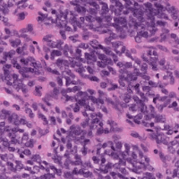

# SarcomaClassification
Supplementary code for my MSc project using CNNs to classify digital pathology slides of sarcomas.

The short videos below show the process of creating some of the images included in the 'Model Interpretation' section of the report.

| Method        | SS            | SFT   |
| ------------- |:-------------:| :-----:|
| Class specific image generation (Inception) |  |  |
| Class specific image generation (AlexNet) | centered      |   $12 |
| Deep Dream (standard)|  |  |
| Deep Dream (altered mean RGB)| are neat      |    $1 |
| Deep Dream (threshold)| are neat      |    $1 |

